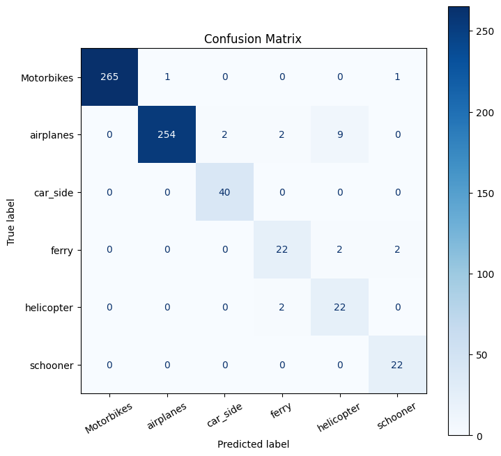
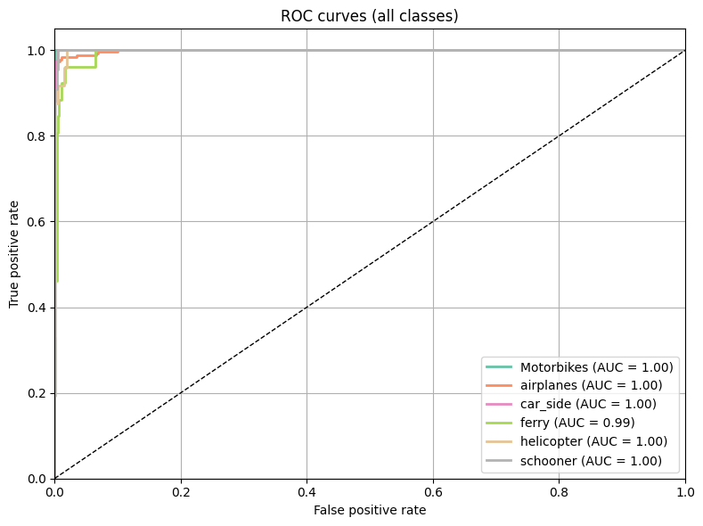
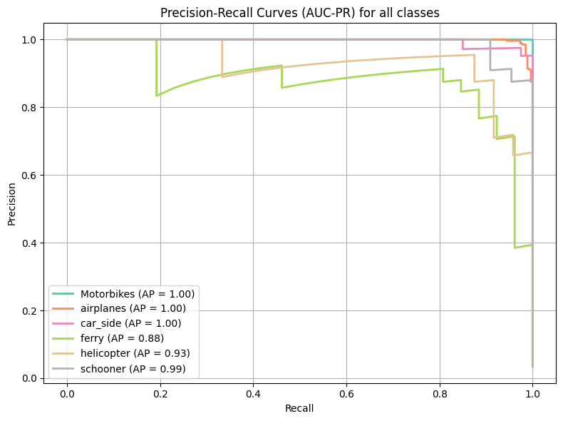
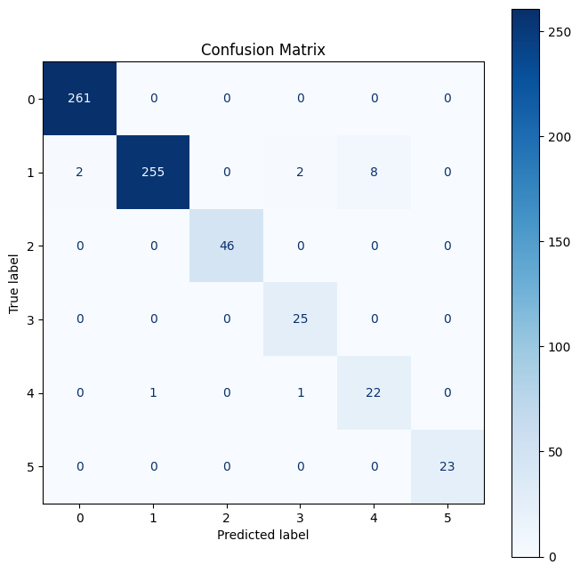
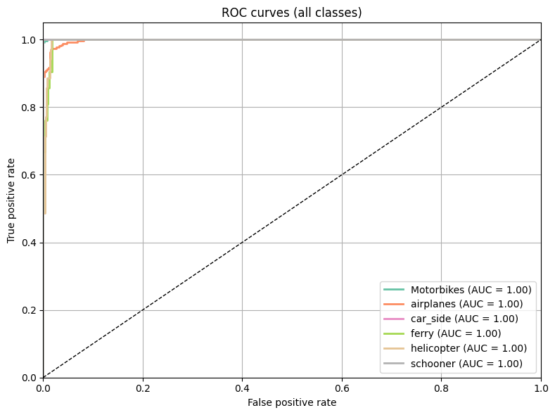
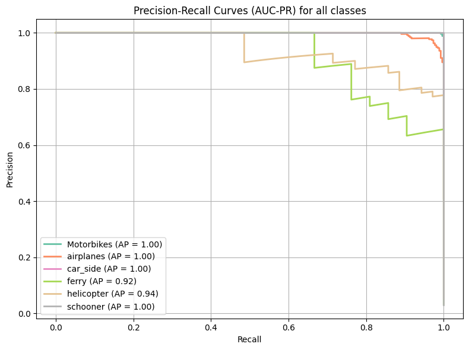
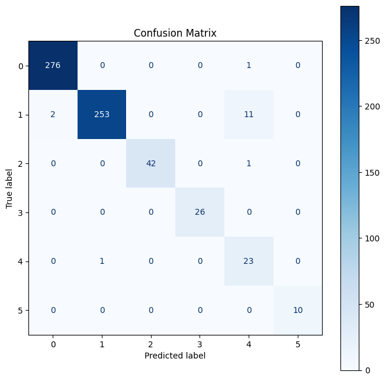
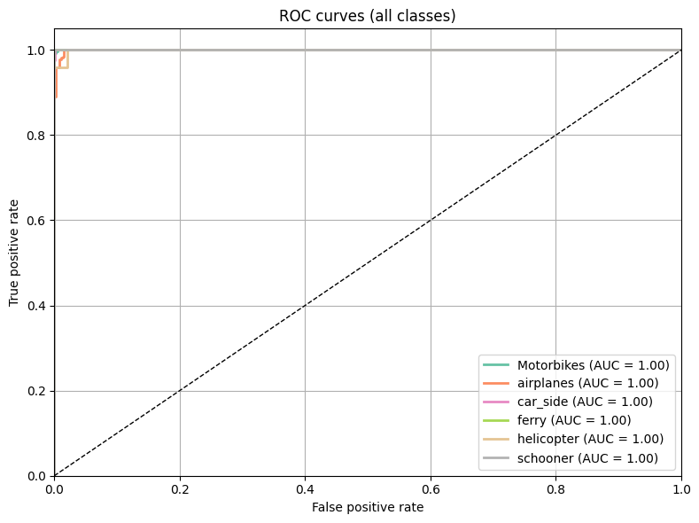
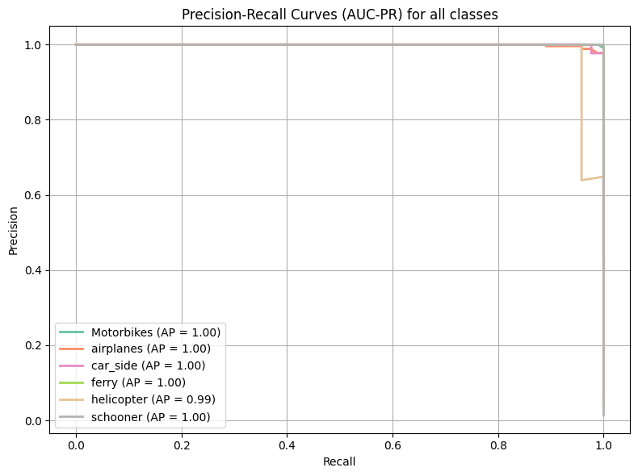

# Using three CNNs to classify images of modes of transportation
This project compares the performance of three Convolutional Neural Network (CNN) approaches for classifying images of transportation modes (e.g., cars, ships, airplanes):

1. **Vanilla CNN** – A CNN model built using keras and trained from scratch.
2. **Frozen Pre-trained ResNet** – A ResNet model pre-trained on ImageNet, with the feature extractor frozen.
3. **Fine-tuned Pre-trained ResNet** – The same pre-trained ResNet, but fine-tuned on the transportation images.

## About
### Notebook structure

- goal statement
- preprocessing
  - resizing the images 
  - create datasets for training, validation, testing
  - oversampling: augment underrepresented classes  
- training    
  - vanilla CNN
    - evaluation
  - frozen pre-trained ResNet
    - evaluation
  - fine-tuned pre-trained ResNet
    - evaluation
- conclusion

### Results

#### Vanilla CNN
92.75 % validation accuracy, 3.25 % top 1 percent error rate




#### Frozen pre-trained ResNet50
99.09 % validation accuracy, 2.17 % top 1 percent error rate




#### Fine-tuned pre-trained ResNet50
97.54 % validation accuracy, 2.48 % top 1 percent error rate




### Conclusion
The most efficient approach is using the frozen ResNet50. It took a short amount of time to train than the ResNet50 with unfrozen layers. The latter performed worse, especially when correctly predicting `helicopter` and `airplane`. The frozen ResNet50 was able to improve on the metrics of the Vanilla CNN, like the `helicopter` classes precision. I was pleasantly surprised by the Vanilla CNNs performance, though.

## Installation
```
git clone https://github.com/psophis/CNN-image-classification-modes-of-transportation.git
```

## Contributing

Pull requests are welcome. For major changes, please open an issue first
to discuss what you would like to change.

## License

[GNU General Public Licence, version 3]([https://www.gnu.org/licenses/gpl-3.0.en.html])
